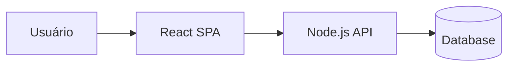

# Visão Arquitetural — <NOME DO PROJETO>

## 1. Visão geral
(A definir)

## 2. Componentes
- **Frontend**: React + TypeScript (SPA)
- **Backend**: Node.js + TypeScript (API)
- **Banco de dados**: (A definir)
- **Autenticação**: (A definir)
- **Observabilidade**: (logs, métricas, tracing) (A definir)

## 3. Fluxos principais
- Fluxo 1:
- Fluxo 2:

## 4. Restrições arquiteturais
-

## 5. Diagrama (placeholder)
(Inserir diagrama em Mermaid/Draw.io)

Exemplo Mermaid (ajuste):

