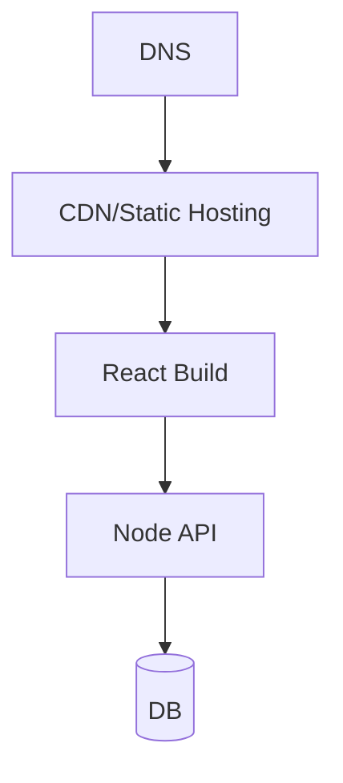

# Diagrama de Implantação

## Ambientes
- dev
- homolog
- prod

## Componentes em produção
- CDN/Static hosting (frontend)
- API (container)
- DB
- Cache (opcional)
- Queue (opcional)

## Diagrama (placeholder)

